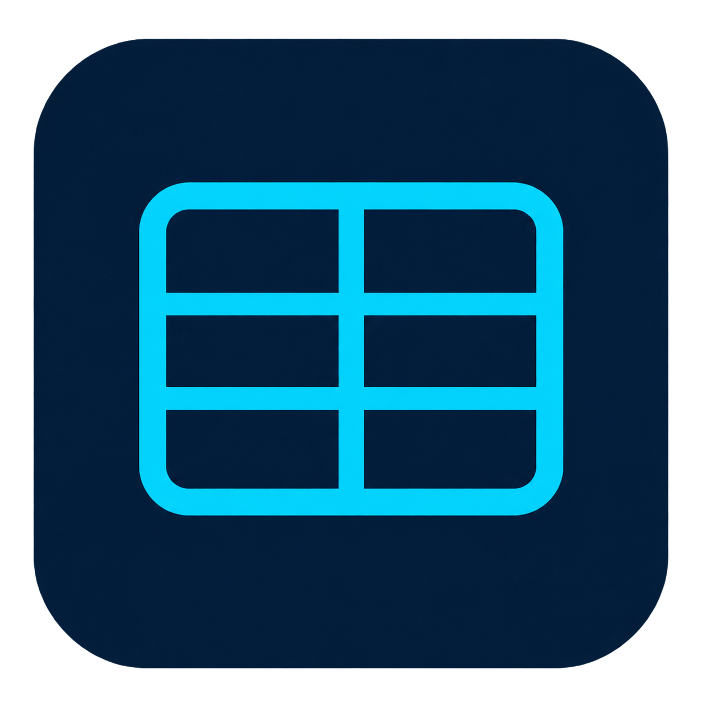
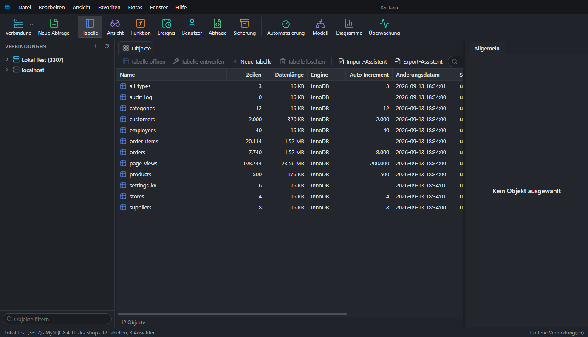
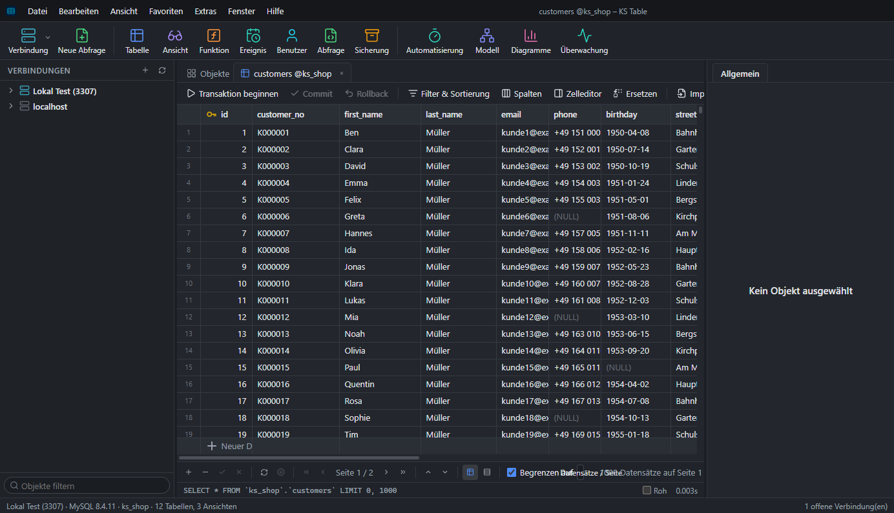
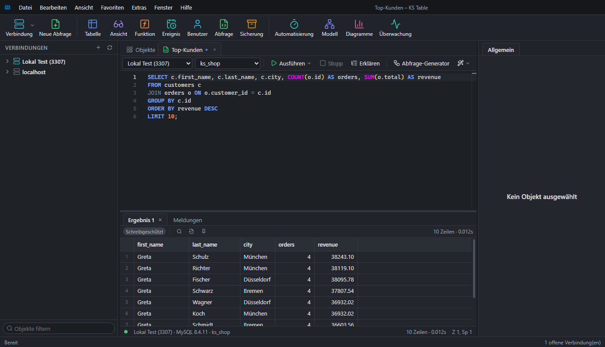
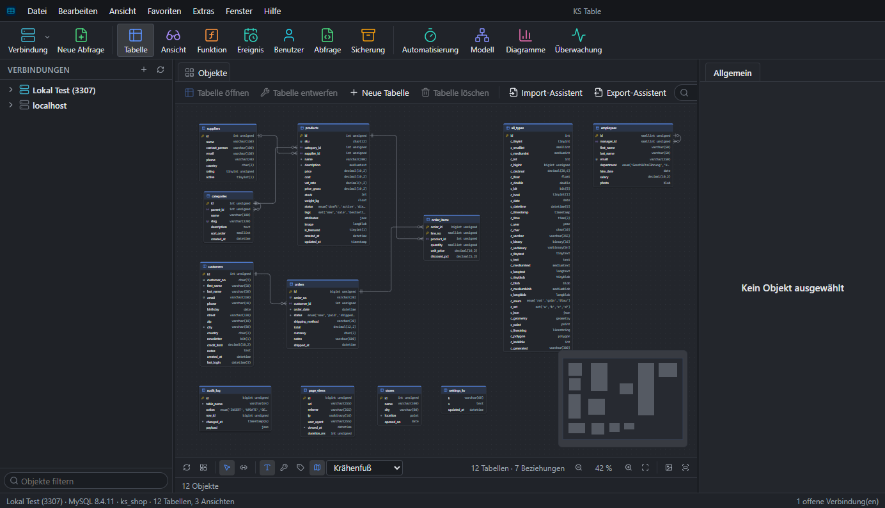

<div align="center">



# KS Table

**A fast, native desktop client for MySQL & MariaDB — built with Electron, React and TypeScript.**

[](LICENSE)


</div>

---

KS Table is a full-featured GUI for administering, querying and modeling MySQL and MariaDB
databases — connect over TCP, SSH tunnel or a PHP HTTP tunnel, browse and edit data in a fast
canvas-rendered grid, write SQL with autocompletion, design tables visually, move data between
servers, model schemas as ER diagrams, and automate backups and recurring jobs — all from one
desktop app with a German and English interface.

## Screenshots

| Objects & databases | Table data editing |
| :---: | :---: |
|  |  |

| SQL query editor | ER diagram |
| :---: | :---: |
|  |  |

## Features

**Connections**
Direct TCP, SSH tunnel, or HTTP tunnel (via a bundled PHP script) for hosts that only expose a
web server; SSL/TLS, saved credentials, connection groups and colors, favorites.

**Browsing & editing data**
A canvas-rendered grid (thousands of rows without lag) with inline editing, a form view for wide
rows, filter & sort builder (or raw SQL), a value/BLOB/image/hex editor, foreign-key pickers, a
find/replace tool, CSV-style multi-cell paste that grows the table, and per-column data profiling
(distinct values, min/max, histograms).

**SQL**
A Monaco-based editor with schema-aware autocompletion, multi-statement execution, EXPLAIN plans,
transactions, saved snippets, a command-line style console, and a visual, drag-and-drop query
builder that reads and writes plain SQL.

**Object designers**
Visual designers for tables (fields, indexes, foreign keys, partitions, triggers, checks), views,
stored procedures/functions, and events — every change previews the generated DDL before you run it.

**Moving data**
Import/export to CSV, TXT, JSON, XML, Excel, HTML, Markdown and SQL; SQL dump and restore; a data
transfer wizard between servers or into a script file; data synchronization (diff and merge rows
between two tables) and structure synchronization (diff and apply schema changes).

**Modeling & insight**
An ER diagram view generated from the live schema, a standalone model designer for schema-first
design (forward/reverse engineering), a data dictionary export, and a chart/dashboard builder for
ad-hoc SQL-backed visualizations.

**Administration & automation**
User and privilege management, a live server monitor (processes, variables, status, InnoDB), a
history log of executed statements, scheduled backups and multi-step jobs (SQL + backup + email
notification) via Windows Task Scheduler, and a test-data generator that respects foreign keys and
unique constraints.

## Tech stack

- **Shell:** [Electron](https://www.electronjs.org/) 44 · [electron-vite](https://electron-vite.org/) · [electron-builder](https://www.electron.build/)
- **UI:** React 18 · TypeScript · [Glide Data Grid](https://github.com/glideapps/glide-data-grid) (canvas grid) · [Monaco Editor](https://microsoft.github.io/monaco-editor/) · [@xyflow/react](https://reactflow.dev/) (diagrams) · [ECharts](https://echarts.apache.org/) · Zustand
- **Database:** [mysql2](https://github.com/sidorares/node-mysql2) · [ssh2](https://github.com/mscdex/ssh2) for tunneling
- **Data:** exceljs · papaparse · fast-xml-parser · sql-formatter · node-sql-parser

## Getting started

### Download

Grab the latest installer or portable build from the [Releases](../../releases) page — no
account, no telemetry. Windows only for now.

### Run from source

Requires Node.js 20+ and a MySQL/MariaDB server to connect to (or use the portable test server
under `dev/`, see below).

```bash
npm install
npm run dev          # Electron app with hot reload
```

```bash
npm run typecheck    # TypeScript, both the Electron/Node and the renderer project
npm test             # Vitest unit tests
npm run dist         # build an installer + portable exe into release/
```

`npm run dev:web` runs the same app in a regular browser tab at `http://localhost:5174` (backend
over a local WebSocket instead of Electron IPC) — handy for quick UI iteration.

### Test database

`dev/` contains scripts for a fully portable MySQL instance (downloaded into `.devdb/`, never
installed as a service) with a sample schema, used for local testing:

```bash
powershell dev/db-setup.ps1   # first time only: download + initialize + seed
powershell dev/db-start.ps1   # start on 127.0.0.1:3307
powershell dev/db-stop.ps1    # stop when done
```

## Project layout

```
src/
  main/        Electron main process (window, menus, IPC)
  preload/     contextBridge surface exposed to the renderer
  backend/     database driver, sessions, feature implementations
  renderer/    React app (src/renderer/src/features/* per module)
  shared/      types, RPC contract, and logic shared by backend + renderer
docs/          architecture notes and screenshots
dev/           portable MySQL test server scripts
```

See [`docs/ARCHITECTURE.md`](docs/ARCHITECTURE.md) for the conventions the codebase follows.

## Status

KS Table currently targets **MySQL and MariaDB**. It is under active development — most features
above are implemented and tested against a live server, but you will find rough edges. Issues and
pull requests are welcome.

## License

[MIT](LICENSE) © Khan Solutions
